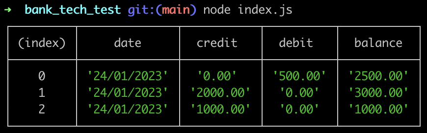
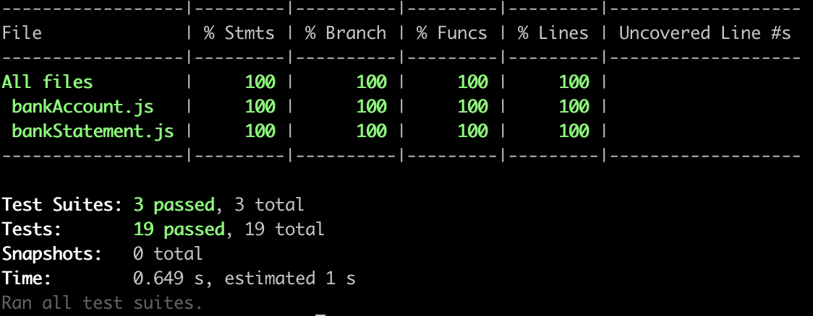

# Bank Tech Test

The task is to create a simple bank account application that allows a user to make deposits, withdrawals, and print a statement of their account activity. The statement should display the date, credit, debit, and balance of each transaction.

### How To Use
1. Clone the repository or download the code.
2. Open a terminal and navigate to the project folder.
3. Run ```npm install``` to install any dependencies.
4. Either run ```node``` to open the Node.js REPL or run ```node index.js```.
5. Run ```jest``` for Jest tests or ```jest --coverage``` to see test coverage.

### Structure and Approach
To solve this problem, I approached it with a focus with TDD and good OOP principles in mind. I decided on splitting the program into 2 classes, 1 to handle transactions and balance, and the other to handle formatting and printing. The program could be split up further by having a new class, Transaction, that would store the data for each transaction and the array of transactions would be instances of this class. I opted against this as, at this point in time, the requirements called for only basic functionality concerning transactions.

Having 2 separate classes with separate functionality rather than 1 large class ensures the code is more structured, maintainable, and easier to test and reuse.

I began by creating the BankAccount class and writing tests for the class' constructor and deposit and withdrawal methods. I used the red-green-refactor cycle to ensure that the code was working as expected and handled both bad and good user input. 

At this stage, I had the date as a second parameter on these methods but decided to remove this and instead use new Date() to get the current date. This is because in reality, a user wouldn’t input the date manually but rather just an amount.

I then created the BankStatement class and added methods to format and print the account statement. I also made sure that the BankAccount class had a method to call the print method of the BankStatement class passing in the transactions array.

### Screenshot of output



### Test Coverage


